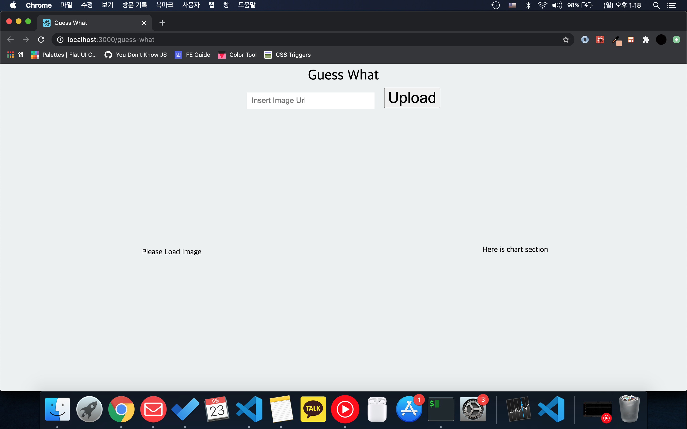
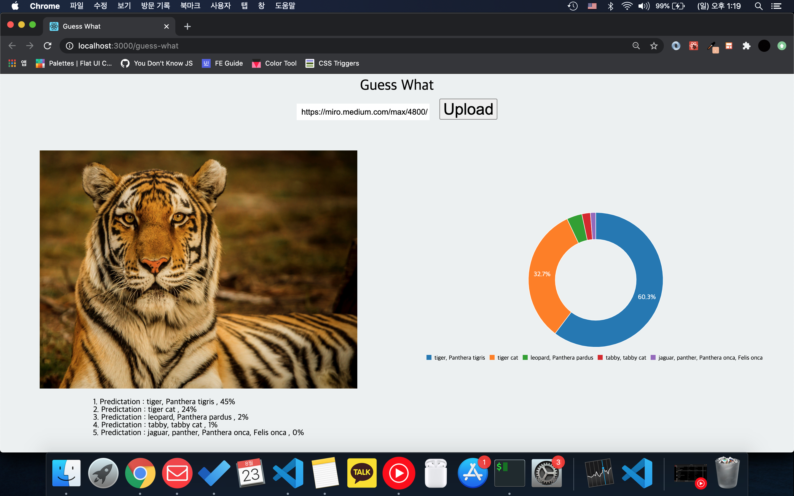

# Guess What


## Project Summary

React.js + ML5.js를 활용하여 이미지 분석, C3.js를 활용한 분석 결과 시각화

## Demo

Link : [Go Demo](https://manngold.github.io/guess-what/)

## Preview

### Before Upload



### After Upload



## Components

```
index.js
|_App.js
  |_Chart.js
  |_Classifier.js
  |_Uploader.js
  |_GlobalStyles.js
```

## Run

`$ yarn start`
